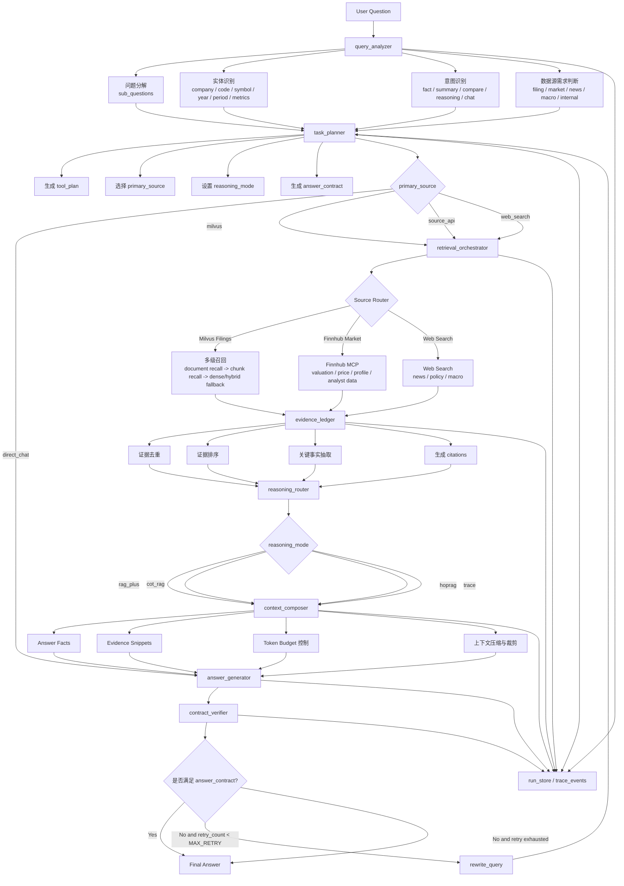

```mermaid
flowchart TD
    A[User Question] --> B[query_analyzer]

    B --> B1[问题分解<br/>sub_questions]
    B --> B2[实体识别<br/>company / code / symbol / year / period / metrics]
    B --> B3[意图识别<br/>fact / summary / compare / reasoning / chat]
    B --> B4[数据源需求判断<br/>filing / market / news / macro / internal]

    B1 --> C[task_planner]
    B2 --> C
    B3 --> C
    B4 --> C

    C --> C1[生成 tool_plan]
    C --> C2[选择 primary_source]
    C --> C3[设置 reasoning_mode]
    C --> C4[生成 answer_contract]

    C --> D{primary_source}

    D -->|direct_chat| J[answer_generator]
    D -->|milvus| E[retrieval_orchestrator]
    D -->|source_api| E
    D -->|web_search| E

    E --> E1{Source Router}

    E1 -->|Milvus Filings| F1[多级召回<br/>document recall -> chunk recall -> dense/hybrid fallback]
    E1 -->|Finnhub Market| F2[Finnhub MCP<br/>valuation / price / profile / analyst data]
    E1 -->|Web Search| F3[Web Search<br/>news / policy / macro]

    F1 --> G[evidence_ledger]
    F2 --> G
    F3 --> G

    G --> G1[证据去重]
    G --> G2[证据排序]
    G --> G3[关键事实抽取]
    G --> G4[生成 citations]

    G1 --> H[reasoning_router]
    G2 --> H
    G3 --> H
    G4 --> H

    H --> H1{reasoning_mode}
    H1 -->|rag_plus| I[context_composer]
    H1 -->|cot_rag| I
    H1 -->|hoprag| I
    H1 -->|trace| I

    I --> I1[Answer Facts]
    I --> I2[Evidence Snippets]
    I --> I3[Token Budget 控制]
    I --> I4[上下文压缩与裁剪]

    I1 --> J[answer_generator]
    I2 --> J
    I3 --> J
    I4 --> J

    J --> K[contract_verifier]

    K --> K1{是否满足 answer_contract?}

    K1 -->|Yes| L[Final Answer]
    K1 -->|No and retry_count < MAX_RETRY| M[rewrite_query]
    K1 -->|No and retry exhausted| L

    M --> C

    K --> N[run_store / trace_events]
    B --> N
    C --> N
    E --> N
    G --> N
    I --> N
    J --> N

```
